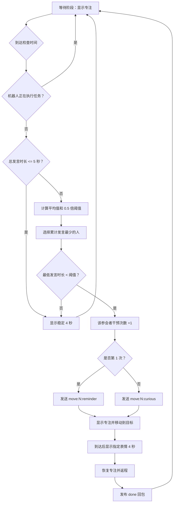

# EffMeet-Bot

EffMeet-Bot 是一套用于 4 人会议发言统计与机器人干预的系统。云端程序持续统计每位参会者的累计发言时长，定时判断发言分布是否失衡；需要干预时，ESP32-S3 机器人移动到对应座位，并通过 TFT 表情完成分级提醒。

当前推荐入口：

- 云端：`cloud_brain/main_brain.py`
- 机器人：`robot_esp32/1.3/1.3.ino`

## 系统组成

| 模块 | 职责 |
| --- | --- |
| `cloud_brain/` | 采集 4 路 USB 麦克风、识别人声、累计发言时长、判断是否干预、记录每人的干预次数、通过 MQTT 下发指令 |
| `robot_esp32/` | 接收 MQTT 指令、显示表情、控制小车转向和巡线、到达目标后展示干预表情、返程并回传完成状态 |

## 当前干预机制

### 1. 座位和节点

系统固定使用 4 个节点：

| 节点 | MQTT 目标编号 | 机器人方向 |
| --- | --- | --- |
| `node1` | `1` | 前 |
| `node2` | `2` | 左 |
| `node3` | `3` | 后 |
| `node4` | `4` | 右 |

云端分别累计 `node1` 到 `node4` 的发言时长。发言时长不会在每轮检查后清零，而是在当前程序会话中持续累积。

### 2. 检查时机

云端默认每 `120` 秒执行一次干预检查。可通过启动参数调整：

```powershell
python main_brain.py --schedule-interval 60
```

如果机器人正在执行移动任务，本轮检查直接跳过，不会重复下发移动或表情指令。

### 3. 是否触发干预

每次检查按以下顺序执行：

1. 计算 4 人总发言时长 `total`。
2. 如果 `total <= 5` 秒，不触发移动，显示稳定表情。
3. 否则计算平均发言时长：`average = total / 4`。
4. 计算干预阈值：`threshold = average × 0.5`。
5. 找出累计发言最少的人。
6. 如果最低发言时长 `< threshold`，触发干预。
7. 如果最低发言时长 `>= threshold`，不触发移动，显示稳定表情。

默认比例 `0.5` 对应 `IMBALANCE_RATIO_THRESHOLD`。当前推荐主程序 `main_brain.py` 在文件顶部定义该值；模块化入口 `main.py` 使用 `config.yaml` 中的 `logic.imbalance_ratio_threshold`。

### 4. 同一人的分级干预

干预次数按参会者分别累计，不是全局共用一个次数：

| 该参会者在当前会话中的干预次数 | 到达后显示的表情 | MQTT 指令 |
| --- | --- | --- |
| 第 1 次 | 提醒 | `move:N:reminder` |
| 第 2 次 | 好奇 | `move:N:curious` |
| 第 3 次及以后 | 好奇 | `move:N:curious` |

例如，`node3` 第一次被干预不影响 `node2` 的计数。之后即使先干预了其他人，`node3` 再次被选中时仍会使用自己的下一等级。

干预计数只在真正触发移动干预时增加。显示稳定表情不会增加或重置任何人的干预计数。

以下情况会把所有人的干预计数归零：

- 重新启动云端主程序。
- 调用程序内部的会话重置逻辑。
- 模块化入口重新创建 `MeetingState`。

### 5. 四种表情

| 表情 | 使用时机 | 持续规则 |
| --- | --- | --- |
| 专注 `focus` | 开机、等待下一轮检查、机器人移动、机器人返程 | 默认持续显示 |
| 提醒 `reminder` | 某位参会者第 1 次被干预，机器人到达该座位后 | 显示 4 秒，然后恢复专注 |
| 好奇 `curious` | 同一参会者第 2 次及以后被干预，机器人到达该座位后 | 显示 4 秒，然后恢复专注 |
| 稳定 `stable` | 本轮检查没有触发移动干预 | 显示 4 秒，然后自动恢复专注 |

这里的“稳定”表示“本轮无需移动干预”，包括总发言时长不足和发言分布未达到干预阈值两种情况。

### 6. 完整状态流程



### 7. 判定示例

假设当前累计发言时长为：

```text
node1 = 100 秒
node2 = 10 秒
node3 = 0 秒
node4 = 15 秒
```

计算结果：

```text
total = 125 秒
average = 125 / 4 = 31.25 秒
threshold = 31.25 × 0.5 = 15.625 秒
最低发言者 = node3，发言 0 秒
0 < 15.625，因此触发干预
```

- 如果这是 `node3` 第 1 次被干预，发送 `move:3:reminder`。
- 如果这是 `node3` 第 2 次或更多次被干预，发送 `move:3:curious`。

## MQTT 协议

默认 Broker：

```text
broker.emqx.io:1883
```

公开 Broker 适合演示和联调，不建议长期生产使用。

### 主题

| 方向 | 主题 | 用途 |
| --- | --- | --- |
| 云端 -> 机器人 | `esp32s3/control` | 移动指令和单独的表情指令 |
| 机器人 -> 云端 | `esp32s3/status` | 在线状态、表情确认、完成回包和故障回包 |
| 云端 -> 上层系统 | `effmeet/cycle/done` | 当前干预序列完成通知 |

### 移动指令

推荐格式：

```text
move:<目标编号>:<到达后表情>
```

有效示例：

```text
move:1:reminder
move:2:curious
move:3:reminder
move:4:curious
```

约束：

- 目标编号只能是 `1`、`2`、`3`、`4`。
- 移动指令中的表情只能是 `reminder` 或 `curious`。
- `move:N` 省略表情时默认使用 `reminder`。
- 旧版纯数字 `1` 到 `4` 仍兼容，等价于 `move:N:reminder`。
- 机器人执行任务期间不会接受新的移动或表情指令。

云端负责决定使用 `reminder` 还是 `curious`。机器人只执行 payload 中指定的表情，不在本地累计某位参会者的干预次数。

### 单独切换表情

格式：

```text
expr:<表情名称>
```

支持的指令：

| payload | 行为 |
| --- | --- |
| `expr:focus` | 显示专注，持续到下一条有效指令 |
| `expr:stable` | 显示稳定 4 秒，然后自动恢复专注 |
| `expr:reminder` | 显示提醒，持续到下一条有效指令 |
| `expr:curious` | 显示好奇，持续到下一条有效指令 |

单独发送表情指令只改变 TFT 显示，不移动机器人，也不改变云端保存的干预次数。

### 完成回包

机器人完成返程后，在 `esp32s3/status` 发布：

```text
done|dir=<当前朝向>|target=<本次目标>|expression=<本次干预表情>
```

示例：

```text
done|dir=3|target=1|expression=curious
```

字段含义：

| 字段 | 含义 |
| --- | --- |
| `dir` | 机器人完成返程后的当前朝向，不是本次目标编号 |
| `target` | 本次移动的目标编号 |
| `expression` | 到达目标后实际显示的干预表情 |

云端收到以 `done` 开头的回包后解除忙碌状态，并发布：

```text
主题：effmeet/cycle/done
payload：cycle_done
```

云端会核对 `target` 和 `expression` 是否与当前在途任务一致。重连后迟到的旧 `done` 不会推进新任务。

### 在线、表情确认和故障回包

机器人连接成功后发布保留消息 `online`；意外断线时 Broker 通过 Last Will 把同一主题更新为 `offline`。

单独表情绘制完成后发布：

```text
ack|type=expression|expression=<表情>|frame=<累计完整帧数>
```

运动阶段找不到计数线或轨迹并达到安全超时时，机器人立即停止电机、恢复专注表情并发布：

```text
error|target=<目标编号>|phase=<失败阶段>
```

云端收到 `error` 后会自动解除忙状态，并撤销本次未完成的干预计数，不需要人工杀后台。云端等待 `done` 超过 180 秒也会自动恢复。

### 典型消息时序

某人第 1 次被干预：

```text
云端 -> esp32s3/control : move:3:reminder
机器人到达 node3       : 显示提醒 4 秒
机器人 -> esp32s3/status: done|dir=X|target=3|expression=reminder
云端 -> effmeet/cycle/done: cycle_done
```

同一人第 2 次被干预：

```text
云端 -> esp32s3/control : move:3:curious
机器人到达 node3       : 显示好奇 4 秒
机器人 -> esp32s3/status: done|dir=X|target=3|expression=curious
云端 -> effmeet/cycle/done: cycle_done
```

本轮不触发干预：

```text
云端 -> esp32s3/control : expr:stable
机器人                  : 显示稳定 4 秒，然后恢复专注
```

## 目录结构

```text
EffMeet-Bot/
├─ cloud_brain/
│  ├─ main_brain.py                  # 当前推荐的云端主程序
│  ├─ main.py                        # 模块化版本入口
│  ├─ config.yaml                    # 模块化入口的 MQTT 和调度参数
│  ├─ requirements.txt               # Python 依赖
│  ├─ templates/dashboard.html        # 实验控制台和下一组按钮
│  ├─ check_status.py                # 终端状态查看器
│  ├─ list_mics.py                   # 列出本机输入设备
│  ├─ core/
│  │  ├─ vad_engine.py               # Silero VAD 封装
│  │  └─ speaker_id.py               # 预留模块
│  ├─ logic/
│  │  ├─ meeting_state.py            # 模块化会议统计与干预逻辑
│  │  └─ commander.py                # 预留模块
│  ├─ network/
│  │  └─ mqtt_manager.py             # 模块化 MQTT 封装
│  ├─ utils/
│  │  ├─ audio_buffer.py             # 音频缓冲与 VAD 过滤
│  │  └─ report_gen.py               # Excel 报表生成
│  ├─ test_hardware_stability.py      # 4 种表情 + 连续 5 次往返验收
│  └─ test_*.py                       # 其他联调和行为测试
├─ robot_esp32/
│  └─ 1.3/
│     ├─ 1.3.ino                     # ESP32-S3 机器人固件
│     ├─ image_array.h               # 专注表情位图
│     ├─ reminder_image.h            # 提醒表情位图
│     ├─ curious_image.h             # 好奇表情位图
│     ├─ stable_image.h              # 稳定表情位图
│     ├─ reminder.png                # 提醒表情预览
│     ├─ curious.png                 # 好奇表情预览
│     ├─ stable.png                  # 稳定表情预览
│     └─ User_Setup.h                 # Arduino_GFX 实际接线参考
├─ scripts/start_effmeet.ps1          # 后台复用/自动启动脚本
├─ 启动实验控制台.bat                 # 双击入口
├─ README.md
└─ READ.me
```

## 云端音频判断

`cloud_brain/main_brain.py` 的音频线程会：

1. 自动识别名称包含 `NODE1_MIC` 到 `NODE4_MIC` 的 4 路输入设备。
2. 启动时校准每一路麦克风的底噪。
3. 计算绝对分贝、相对底噪得分和领先差。
4. 结合 Silero VAD 判断是否为有效人声。
5. 只给当前最可信的发言节点累计时长。
6. 将语音片段交给 Faster-Whisper 转写。
7. 通过 Flask 接口暴露当前状态。

如果某一路麦克风长期偏大或偏小，可调整 `main_brain.py` 中的：

```python
MIC_GAIN_OFFSETS_DB = {
    "node1": 0.0,
    "node2": 0.0,
    "node3": 0.0,
    "node4": 0.0,
}
```

## 机器人任务流程

机器人收到 `move:N:expression` 后：

1. 将状态设为忙碌，并显示专注表情。
2. 根据当前朝向和目标编号计算需要旋转的步数。
3. 对线后巡线前往目标；全程持续服务 MQTT 保活。
4. 到达后停止，硬复位 TFT 并完整显示指定的提醒或好奇表情。
5. 停留 4 秒。
6. 恢复专注表情，原地掉头并巡线返回起点。
7. 停止电机，再次复位 TFT 并完整绘制专注表情。
8. 更新当前朝向。
9. 发布 `done` 回包；若当时断线则暂存，重连后自动补发。
10. 解除忙碌状态，继续等待下一条指令。

TFT 使用整屏地址窗口连续写入 480×320 像素，不再逐像素重复设置地址。该改动显著缩短刷新时间，避免网络保活被长时间占用，也降低只完成半屏刷新的概率。

## 运行环境

### 云端

- Windows 10 / 11
- Python 3.10+
- 4 路 USB 麦克风
- 可访问 MQTT Broker 的网络

### 机器人端

- ESP32-S3 开发板
- L298N 电机驱动模块
- 左右直流减速电机
- 5 路循迹传感器
- 1 路红外计数传感器
- 3.5 英寸 ILI9488 TFT LCD

已验证可编译的 Arduino 依赖：

- 开发板核心：`esp32:esp32 3.0.7`
- `PubSubClient 2.8.0`
- `GFX Library for Arduino 1.5.0`

`GFX Library for Arduino 1.6.7` 使用了更新的 ESP LCD API，不能与 `esp32:esp32 3.0.7` 组合编译。升级 GFX 时需要同时升级 ESP32 核心。

## 快速开始

### 1. 配置麦克风名称

在 Windows 录音设备中，把 4 个输入设备重命名为：

```text
NODE1_MIC
NODE2_MIC
NODE3_MIC
NODE4_MIC
```

### 2. 安装云端依赖

```powershell
cd cloud_brain
python -m venv .venv
.\.venv\Scripts\activate
python -m pip install --upgrade pip
python -m pip install -r requirements.txt
```

### 3. 检查麦克风

```powershell
cd cloud_brain
python list_mics.py
```

确认程序能识别 `NODE1_MIC` 到 `NODE4_MIC`。

### 4. 配置并烧录机器人

打开 `robot_esp32/1.3/1.3.ino`，确认：

- `WIFI_SSID` 和 `WIFI_PASSWORD` 正确。
- MQTT Broker 和主题与云端一致。
- 开发板选择 ESP32-S3。
- Arduino 库版本与上方验证版本一致。
- TFT `RST` 接在 **IO42**。旧说明中的 IO33 已废弃，不能继续按旧表接线。

烧录后通过串口确认 Wi-Fi、MQTT 和 TFT 初始化成功。

### 5. 一键启动实验控制台（推荐）

直接双击仓库根目录的：

```text
启动实验控制台.bat
```

脚本会先检查后台是否已经运行：

- 已运行：直接复用，不会结束或重复启动后台。
- 未运行：自动使用 `cloud_brain/.venv`（若存在）启动 `main_brain.py`，等待就绪后打开浏览器。
- 启动日志：保存在 `cloud_brain/data/logs/`。

控制台地址为 <http://127.0.0.1:5000/>。

### 6. 手动启动（备用）

```powershell
cd cloud_brain
python main_brain.py
```

启动成功后会输出：

```text
[READY] 系统全部就绪，等待发言数据...
```

### 7. 查看实时状态

另开一个终端：

```powershell
cd cloud_brain
python check_status.py
```

也可以直接保持浏览器中的实验控制台打开，它每 2 秒刷新 4 人发言时长、干预次数、MQTT 和机器人状态。

## 连续多组 4 人实验

后台在整场测试期间只启动一次，不需要在每组实验前杀进程。

1. 完成当前 4 人实验，等待机器人回到起点，控制台显示“空闲”。
2. 点击“归档并开始下一组”。
3. 系统先把当前组数据写入 `cloud_brain/data/sessions/session_<组编号>.json`。
4. 写入成功后，发言时长、转写记录、干预次数和最近事件同时归零。
5. 调度检查倒计时从完整的 120 秒重新开始，机器人切回专注表情。

若机器人仍在执行任务，按钮会被禁用，接口也会返回 `409`，从而避免上一组的返程或转写混入下一组。已经在后台处理的旧语音带有实验组编号，即使稍后才转写完成也会被自动丢弃。

## 调试参数

```powershell
python main_brain.py --smoke
python main_brain.py --no-mic
python main_brain.py --loose-thresholds
python main_brain.py --schedule-interval 60
python main_brain.py --no-mic --schedule-interval 10 --demo-state node1=100,node2=10,node3=0,node4=15
```

| 参数 | 说明 |
| --- | --- |
| `--smoke` | 只检查麦克风是否可识别，不启动 Web、MQTT 和音频线程 |
| `--no-mic` | 不打开麦克风流，保留 Web 和 MQTT 调度，适合联调 |
| `--loose-thresholds` | 放宽音频判定阈值，适合现场调试 |
| `--schedule-interval` | 修改干预检查间隔，单位为秒 |
| `--demo-state` | 注入测试发言时长；当前应与 `--no-mic` 配合使用 |

## 本地状态接口

云端启动后开放：

```text
GET http://127.0.0.1:5000/api/get_meeting_data
```

返回内容包括：

- `current_speaking_times`
- `total_speaking_time`
- `latest_records`
- `latest_speaking_events`
- `latest_audio_state`
- `session_id` / `session_started_at`
- `intervention_counts`
- `robot_busy` / `mqtt_connected` / `robot_online`
- `next_schedule_check_at`

其他本地接口：

```text
GET  http://127.0.0.1:5000/api/health
POST http://127.0.0.1:5000/api/session/reset
```

`POST /api/session/reset` 等价于控制台按钮：先归档，再开始干净的新实验组。

## 测试与联调

### 分级干预行为测试

不需要真实 MQTT 或机器人：

```powershell
cd cloud_brain
python test_intervention_expressions.py
```

该测试验证：

- 同一人的第 1 次干预使用提醒。
- 同一人的第 2 次及以后使用好奇。
- 未触发干预时发送稳定表情。

### MQTT 调度链路测试

```powershell
cd cloud_brain
python test_dispatch.py
```

可在 MQTTX 中同时订阅：

```text
esp32s3/control
esp32s3/status
effmeet/cycle/done
```

模拟机器人完成回包：

```text
向 esp32s3/status 发布：done|dir=2|target=3|expression=reminder
```

### 现场连续 5 轮稳定性验收

烧录机器人、放到轨道起点并确认周围安全后运行：

```powershell
cd cloud_brain
python test_hardware_stability.py
```

脚本先依次显示专注、提醒、好奇、稳定，每个表情都等待机器人返回带帧号的 `ack`；随后默认执行 `1 → 2 → 3 → 4 → 1` 共 5 次完整往返，并逐次核对 `done` 的目标和表情。结果保存到 `cloud_brain/data/hardware_tests/`。

只检查 4 种表情、不移动机器人：

```powershell
python test_hardware_stability.py --expression-only
```

软件只能确认整帧绘制函数执行完毕和 MQTT 链路未断；正式验收仍需现场观察每次是否完整覆盖整块屏幕。

### 其他测试

- `test_local_mic.py`：本地麦克风和 VAD。
- `test_multi_mic.py`：4 路麦克风输入与统计。
- `test_meeting_logic.py`：会议状态和调度链路。

## 配置说明

当前有两个云端入口：

- `main_brain.py`：推荐入口，主要运行参数直接定义在文件顶部，并可用命令行参数覆盖检查间隔。
- `main.py`：模块化入口，读取 `config.yaml`，内部使用 `MeetingState` 和 `MQTTManager`。

`config.yaml` 中的 `intervention_interval` 和 `imbalance_ratio_threshold` 已用于模块化入口。`variance_threshold`、`cooldown_seconds` 和 `intervention_order` 当前属于预留配置，不会改变推荐入口 `main_brain.py` 的实际判定流程。

## 注意事项

- 机器人执行任务期间会持续维护 MQTT，但不会接受新的移动或表情指令；云端会等待 `done` 后再调度。
- 干预次数按实验组保存在云端内存；点击“归档并开始下一组”或重启云端后归零。
- 机器人重启不会自动恢复云端的干预计数；表情等级始终由云端 payload 决定。
- `expr:stable` 会自动恢复专注；直接发送 `expr:reminder` 或 `expr:curious` 不会自动恢复。
- TFT 复位脚必须接 IO42。若修复后仍在电机启停时出现花屏/半屏，需要检查屏幕和电机供电压降、共地、接头松动及电机端抑制干扰；软件会在电机停止后自动复位并重绘，但无法补偿持续的硬件掉电。
- 首次运行 Faster-Whisper 和 Torch 时可能需要下载模型缓存。
- `cloud_brain/core/speaker_id.py` 和 `cloud_brain/logic/commander.py` 当前为预留模块。

## 推荐启动顺序

1. 烧录并启动 ESP32-S3 机器人。
2. 确认机器人已连接 Wi-Fi 和 MQTT。
3. 给 4 路麦克风设置正确名称。
4. 运行 `python list_mics.py` 检查设备。
5. 双击 `启动实验控制台.bat`，等待浏览器显示云端和机器人均在线。
6. 在控制台观察统计；每组结束后点击“归档并开始下一组”。
7. 正式实验前运行 `python test_hardware_stability.py`，现场完成连续 5 轮验收。
