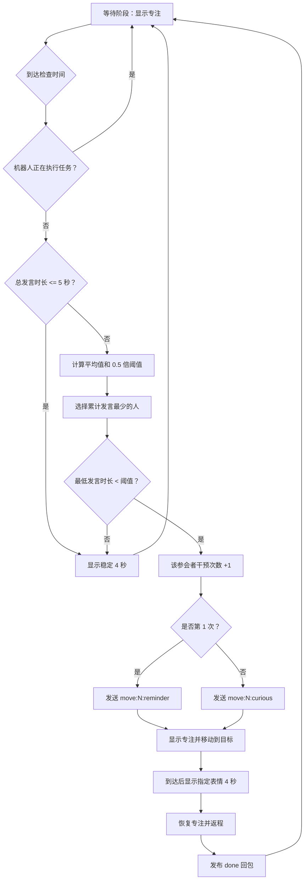

# EffMeet-Bot

EffMeet-Bot 是一套用于 4 人会议发言统计与机器人干预的系统。每组实验必须经过明确的“开始”和“结束”：开始后同步采集 4 路独立录音并统计每位参会者的累计发言时长，定时判断发言分布是否失衡；需要干预时，ESP32-S3 机器人移动到对应座位，并通过 TFT 表情完成分级提醒。结束后系统封口 WAV、传送到指定路径、逐文件校验，并自动关闭后台。

当前推荐入口：

- 云端：`cloud_brain/main_brain.py`
- 机器人：`robot_esp32/1.3/1.3.ino`

## 系统组成

| 模块 | 职责 |
| --- | --- |
| `cloud_brain/` | 明确开始/结束实验，采集并保存 4 路 USB 麦克风，识别人声、累计发言时长、判断是否干预、记录每人的干预次数、通过 MQTT 下发指令，校验并传送实验文件 |
| `robot_esp32/` | 接收 MQTT 指令、显示表情、控制小车转向和巡线、到达目标后展示干预表情、返程并回传完成状态 |

## 实验开始与结束

一组实验对应一个后台进程，状态流转固定为：

```text
尚未开始（不录音）
  -> 明确开始（4 路录音 + 发言分析 + 干预调度）
  -> 明确结束（停止采集 -> WAV 封口 -> 等待最后转写）
  -> 传送至指定路径（大小 + SHA-256 校验）
  -> 成功后自动关闭后台
```

关键约束：

- 后台启动成功不等于实验开始；在明确开始前不会打开麦克风录音流。
- 开始实验要求 `NODE1_MIC` 到 `NODE4_MIC`、云端 MQTT、机器人全部在线，且机器人空闲。
- 点击结束后先禁止新的干预调度，再停止 4 路采集；传送和校验完成前不能把本组视为成功结束。
- 传送失败时后台不会退出，本机暂存文件不会删除，可修复目标盘或网络路径后重试。
- WAV 写入/封口完整性失败时系统不会把实验标记为完整，也不会自动删除暂存数据。

## 当前干预机制

### 1. 座位和节点

系统固定使用 4 个节点：

| 节点 | MQTT 目标编号 | 机器人方向 |
| --- | --- | --- |
| `node1` | `1` | 前 |
| `node2` | `2` | 左 |
| `node3` | `3` | 后 |
| `node4` | `4` | 右 |

云端分别累计 `node1` 到 `node4` 的发言时长。发言时长不会在每轮检查后清零，而是在当前程序会话中持续累积。

### 2. 检查时机

云端默认每 `120` 秒执行一次干预检查。可通过启动参数调整：

```powershell
python main_brain.py --schedule-interval 60
```

如果机器人正在执行移动任务，本轮检查直接跳过，不会重复下发移动或表情指令。

### 3. 是否触发干预

每次检查按以下顺序执行：

1. 计算 4 人总发言时长 `total`。
2. 如果 `total <= 5` 秒，不触发移动，显示稳定表情。
3. 否则计算平均发言时长：`average = total / 4`。
4. 计算干预阈值：`threshold = average × 0.5`。
5. 找出累计发言最少的人。
6. 如果最低发言时长 `< threshold`，触发干预。
7. 如果最低发言时长 `>= threshold`，不触发移动，显示稳定表情。

默认比例 `0.5` 对应 `IMBALANCE_RATIO_THRESHOLD`。当前推荐主程序 `main_brain.py` 在文件顶部定义该值；模块化入口 `main.py` 使用 `config.yaml` 中的 `logic.imbalance_ratio_threshold`。

### 4. 同一人的分级干预

干预次数按参会者分别累计，不是全局共用一个次数：

| 该参会者在当前会话中的干预次数 | 到达后显示的表情 | MQTT 指令 |
| --- | --- | --- |
| 第 1 次 | 提醒 | `move:N:reminder` |
| 第 2 次 | 好奇 | `move:N:curious` |
| 第 3 次及以后 | 好奇 | `move:N:curious` |

例如，`node3` 第一次被干预不影响 `node2` 的计数。之后即使先干预了其他人，`node3` 再次被选中时仍会使用自己的下一等级。

干预计数只在真正触发移动干预时增加。显示稳定表情不会增加或重置任何人的干预计数。

以下情况会把所有人的干预计数归零：

- 重新启动云端主程序。
- 调用程序内部的会话重置逻辑。
- 模块化入口重新创建 `MeetingState`。

### 5. 四种表情

| 表情 | 使用时机 | 持续规则 |
| --- | --- | --- |
| 专注 `focus` | 开机、等待下一轮检查、机器人移动、机器人返程 | 默认持续显示 |
| 提醒 `reminder` | 某位参会者第 1 次被干预，机器人到达该座位后 | 显示 4 秒，然后恢复专注 |
| 好奇 `curious` | 同一参会者第 2 次及以后被干预，机器人到达该座位后 | 显示 4 秒，然后恢复专注 |
| 稳定 `stable` | 本轮检查没有触发移动干预 | 显示 4 秒，然后自动恢复专注 |

这里的“稳定”表示“本轮无需移动干预”，包括总发言时长不足和发言分布未达到干预阈值两种情况。

### 6. 完整状态流程



### 7. 判定示例

假设当前累计发言时长为：

```text
node1 = 100 秒
node2 = 10 秒
node3 = 0 秒
node4 = 15 秒
```

计算结果：

```text
total = 125 秒
average = 125 / 4 = 31.25 秒
threshold = 31.25 × 0.5 = 15.625 秒
最低发言者 = node3，发言 0 秒
0 < 15.625，因此触发干预
```

- 如果这是 `node3` 第 1 次被干预，发送 `move:3:reminder`。
- 如果这是 `node3` 第 2 次或更多次被干预，发送 `move:3:curious`。

## MQTT 协议

默认 Broker：

```text
broker.emqx.io:1883
```

公开 Broker 适合演示和联调，不建议长期生产使用。

### 主题

| 方向 | 主题 | 用途 |
| --- | --- | --- |
| 云端 -> 机器人 | `esp32s3/control` | 移动指令和单独的表情指令 |
| 机器人 -> 云端 | `esp32s3/status` | 在线状态、表情确认、完成回包和故障回包 |
| 云端 -> 上层系统 | `effmeet/cycle/done` | 当前干预序列完成通知 |

### 移动指令

推荐格式：

```text
move:<目标编号>:<到达后表情>
```

有效示例：

```text
move:1:reminder
move:2:curious
move:3:reminder
move:4:curious
```

约束：

- 目标编号只能是 `1`、`2`、`3`、`4`。
- 移动指令中的表情只能是 `reminder` 或 `curious`。
- `move:N` 省略表情时默认使用 `reminder`。
- 旧版纯数字 `1` 到 `4` 仍兼容，等价于 `move:N:reminder`。
- 机器人执行任务期间不会接受新的移动或表情指令。

云端负责决定使用 `reminder` 还是 `curious`。机器人只执行 payload 中指定的表情，不在本地累计某位参会者的干预次数。

### 单独切换表情

格式：

```text
expr:<表情名称>
```

支持的指令：

| payload | 行为 |
| --- | --- |
| `expr:focus` | 显示专注，持续到下一条有效指令 |
| `expr:stable` | 显示稳定 4 秒，然后自动恢复专注 |
| `expr:reminder` | 显示提醒，持续到下一条有效指令 |
| `expr:curious` | 显示好奇，持续到下一条有效指令 |

单独发送表情指令只改变 TFT 显示，不移动机器人，也不改变云端保存的干预次数。

### 完成回包

机器人完成返程后，在 `esp32s3/status` 发布：

```text
done|dir=<当前朝向>|target=<本次目标>|expression=<本次干预表情>
```

示例：

```text
done|dir=3|target=1|expression=curious
```

字段含义：

| 字段 | 含义 |
| --- | --- |
| `dir` | 机器人完成返程后的当前朝向，不是本次目标编号 |
| `target` | 本次移动的目标编号 |
| `expression` | 到达目标后实际显示的干预表情 |

云端收到以 `done` 开头的回包后解除忙碌状态，并发布：

```text
主题：effmeet/cycle/done
payload：cycle_done
```

云端会核对 `target` 和 `expression` 是否与当前在途任务一致。重连后迟到的旧 `done` 不会推进新任务。

### 在线、表情确认和故障回包

机器人连接成功后发布保留消息 `online`；意外断线时 Broker 通过 Last Will 把同一主题更新为 `offline`。

单独表情绘制完成后发布：

```text
ack|type=expression|expression=<表情>|frame=<累计完整帧数>
```

运动阶段找不到计数线或轨迹并达到安全超时时，机器人立即停止电机、恢复专注表情并发布：

```text
error|target=<目标编号>|phase=<失败阶段>
```

云端收到 `error` 后会自动解除忙状态，并撤销本次未完成的干预计数，不需要人工杀后台。云端等待 `done` 超过 180 秒也会自动恢复。

### 典型消息时序

某人第 1 次被干预：

```text
云端 -> esp32s3/control : move:3:reminder
机器人到达 node3       : 显示提醒 4 秒
机器人 -> esp32s3/status: done|dir=X|target=3|expression=reminder
云端 -> effmeet/cycle/done: cycle_done
```

同一人第 2 次被干预：

```text
云端 -> esp32s3/control : move:3:curious
机器人到达 node3       : 显示好奇 4 秒
机器人 -> esp32s3/status: done|dir=X|target=3|expression=curious
云端 -> effmeet/cycle/done: cycle_done
```

本轮不触发干预：

```text
云端 -> esp32s3/control : expr:stable
机器人                  : 显示稳定 4 秒，然后恢复专注
```

## 目录结构

```text
EffMeet-Bot/
├─ cloud_brain/
│  ├─ main_brain.py                  # 当前推荐的云端主程序
│  ├─ experiment_recording.py         # 4 路 WAV 暂存、封口、校验和传送
│  ├─ main.py                        # 模块化版本入口
│  ├─ config.yaml                    # 模块化入口的 MQTT 和调度参数
│  ├─ requirements.txt               # Python 依赖
│  ├─ EffMeet.spec                   # PyInstaller 打包配置
│  ├─ templates/dashboard.html        # 明确开始/结束实验控制台
│  ├─ check_status.py                # 终端状态查看器
│  ├─ list_mics.py                   # 列出本机输入设备
│  ├─ check_mics.py                  # 麦克风连接自检（逐个录音测分贝）
│  ├─ core/
│  │  ├─ activity_engine.py          # robust 人声判定状态机（自适应底噪+主导说话人）
│  │  ├─ vad_engine.py               # Silero VAD 封装（可禁用）
│  │  └─ speaker_id.py               # 预留模块
│  ├─ logic/
│  │  ├─ meeting_state.py            # 模块化会议统计与干预逻辑
│  │  └─ commander.py                # 预留模块
│  ├─ network/
│  │  └─ mqtt_manager.py             # 模块化 MQTT 封装
│  ├─ utils/
│  │  ├─ audio_buffer.py             # 音频缓冲与 VAD 过滤
│  │  └─ report_gen.py               # Excel 报表生成
│  ├─ test_activity_engine.py         # robust 人声判定离线测试
│  ├─ test_hardware_stability.py      # 4 种表情 + 连续 5 次往返验收
│  ├─ test_experiment_recording.py    # 录音格式、命名、校验和重试测试
│  ├─ test_experiment_lifecycle.py    # HTTP 开始/结束/自动关后台测试
│  └─ test_*.py                       # 其他联调和行为测试
├─ robot_esp32/
│  └─ 1.3/
│     ├─ 1.3.ino                     # ESP32-S3 机器人固件
│     ├─ image_array.h               # 专注表情位图
│     ├─ reminder_image.h            # 提醒表情位图
│     ├─ curious_image.h             # 好奇表情位图
│     ├─ stable_image.h              # 稳定表情位图
│     ├─ reminder.png                # 提醒表情预览
│     ├─ curious.png                 # 好奇表情预览
│     ├─ stable.png                  # 稳定表情预览
│     └─ User_Setup.h                 # Arduino_GFX 实际接线参考
├─ scripts/start_effmeet.ps1          # 启动或复用就绪后台
├─ scripts/begin_experiment.ps1       # 开始实验的确认与接口调用
├─ scripts/end_experiment.ps1         # 结束、校验、打开结果目录
├─ 开始实验.bat                       # 推荐的明确开始入口
├─ 结束实验.bat                       # 推荐的明确结束入口
└─ README.md
```

## 云端音频判断

默认（`--detect-mode robust`）的判定由 `cloud_brain/core/activity_engine.py` 的
`ActivityEngine` 承担，`main_brain.py` 的音频线程逐块喂入 4 路分贝并取出判定结果：

1. 自动识别名称包含 `NODE1_MIC` 到 `NODE4_MIC` 的 4 路输入设备。
2. 每路维护一个**自适应底噪**，环境噪声漂移时缓慢跟随，不写死一次性校准值。
3. 全局用**双门限 VAD** 判断"整场是否有持续人声"，带静音容忍（说话中的短暂停顿不误停）。
4. **主导说话人归属**：只在"确实在说话"的前提下，把连续超阈值且稳定的那路判为主说话人；
   切换跳转需要持续证据（`lead_confirm`），串音/单个尖峰不会抢归属——因此"捂住麦克风
   不说话不会乱计时"。
5. 只给当前主导说话人累计时长，并将分贝/底噪/归属写入 `latest_audio_state` 供排查。
6. 若开启语音转写（默认 `--no-whisper` 关闭），把语音片段交给 Faster-Whisper 转写。
7. 通过 Flask 接口暴露当前状态。

判定参数（可调）位于 `main_brain.py` 顶部：

```text
SPEECH_HI_DB = 10.0     # 双门限开口高门限（相对底噪）
SPEECH_LO_DB = 6.0      # 双门限维持低门限（相对底噪）
FLOOR_ALPHA = 0.03      # 自适应底噪时间常数
VAD_MAX_SIL = 3         # 全局 VAD 静音容忍块数
DOM_HANGOVER = 3        # 主导者静音容忍块数
DOM_LEAD_CONFIRM = 2    # 主导者接管前需持续块数
```

如果某一路麦克风长期偏大或偏小，可调整 `main_brain.py` 中的：

```python
MIC_GAIN_OFFSETS_DB = {
    "node1": 0.0,
    "node2": 0.0,
    "node3": 0.0,
    "node4": 0.0,
}
```

## 机器人任务流程

机器人收到 `move:N:expression` 后：

1. 将状态设为忙碌，并显示专注表情。
2. 根据当前朝向和目标编号计算需要旋转的步数。
3. 对线后巡线前往目标；全程持续服务 MQTT 保活。
4. 到达后停止，硬复位 TFT 并完整显示指定的提醒或好奇表情。
5. 停留 4 秒。
6. 恢复专注表情，原地掉头并巡线返回起点。
7. 停止电机，再次复位 TFT 并完整绘制专注表情。
8. 更新当前朝向。
9. 发布 `done` 回包；若当时断线则暂存，重连后自动补发。
10. 解除忙碌状态，继续等待下一条指令。

TFT 使用整屏地址窗口连续写入 480×320 像素，不再逐像素重复设置地址。该改动显著缩短刷新时间，避免网络保活被长时间占用，也降低只完成半屏刷新的概率。

## 运行环境

### 云端

- Windows 10 / 11
- Python 3.10+（源码运行）
- 4 路 USB 麦克风
- 可访问 MQTT Broker 的网络

> 不想装 Python？可以直接用打包好的 exe（见下节"打包与分发"），双击即启动，目标电脑免装 Python。

### 打包与分发

项目可用 PyInstaller 打成一个免装 Python 的绿色目录（缺省剥离 torch / faster-whisper，
专注录音 + 人声判定 + 机器人干预）。产物在 `cloud_brain/dist/EffMeet/`：

- `EffMeet.exe` —— 后台主程序（等价 `python main_brain.py --no-whisper --no-vad`）
- `check_mics.exe` —— 麦克风自检工具
- 把整个目录拷贝到任意一台 Windows 电脑，双击 `EffMeet.exe` 即启动，浏览器开
  <http://127.0.0.1:5000/> 使用。

本地重新打包：

```powershell
cd cloud_brain
python -m pip install pyinstaller -r requirements_pack.txt   # 见下
python -m PyInstaller EffMeet.spec --noconfirm --clean
```

打包环境要求常规 Python（微软商店版 Python 无法被 PyInstaller 打包，请用 python.org 或
Anaconda 安装版）。`requirements_pack.txt` 提供不含 torch/whisper 的依赖清单：
`paho-mqtt numpy pandas openpyxl PyYAML sounddevice Flask`。

> 语义：exe 默认剥离 Whisper 转写，但保留录音 + 人声判定 + 机器人干预（robust 判定
> 不依赖 torch）。若需转写，源码运行上述完整功能，或用 `--no-whisper` 显式关闭。

已发布的可运行版本可从 GitHub Release 下载：

```text
https://github.com/eleanor-wsyy/EffMeet-Bot/releases
```

### 机器人端

- ESP32-S3 开发板
- L298N 电机驱动模块
- 左右直流减速电机
- 5 路循迹传感器
- 1 路红外计数传感器
- 3.5 英寸 ILI9488 TFT LCD

已验证可编译的 Arduino 依赖：

- 开发板核心：`esp32:esp32 3.0.7`
- `PubSubClient 2.8.0`
- `GFX Library for Arduino 1.5.0`

`GFX Library for Arduino 1.6.7` 使用了更新的 ESP LCD API，不能与 `esp32:esp32 3.0.7` 组合编译。升级 GFX 时需要同时升级 ESP32 核心。

## 快速开始

### 1. 配置麦克风名称

在 Windows 录音设备中，把 4 个输入设备重命名为：

```text
NODE1_MIC
NODE2_MIC
NODE3_MIC
NODE4_MIC
```

### 2. 安装云端依赖

```powershell
cd cloud_brain
python -m venv .venv
.\.venv\Scripts\activate
python -m pip install --upgrade pip
python -m pip install -r requirements.txt
```

### 3. 检查麦克风

先 `list_mics.py` 列出输入设备：

```powershell
cd cloud_brain
python list_mics.py
```

再用 `check_mics.py` 真正逐个打开录音流、测量分贝，确认"设备在"且"有声音"（而不是
只列出设备）：

```powershell
cd cloud_brain
python check_mics.py
python check_mics.py --seconds 3      # 每路多测几秒更稳
python check_mics.py --verbose        # 额外打印所有输入设备
```

输出会区分 ✅ 有声音 / ⚠️ 静音疑似无信号 / ❌ 未识别到。确认 4 路都 `✅` 即可。打包版
双击 `check_mics.exe` 也能自检，无需装 Python。

### 4. 配置并烧录机器人

打开 `robot_esp32/1.3/1.3.ino`，确认：

- `WIFI_SSID` 和 `WIFI_PASSWORD` 正确。
- MQTT Broker 和主题与云端一致。
- 开发板选择 ESP32-S3。
- Arduino 库版本与上方验证版本一致。
- TFT `RST` 接在 **IO42**。旧说明中的 IO33 已废弃，不能继续按旧表接线。
- TFT 数据线 `D7` 接在 **GPIO18**。旧版本使用的 GPIO19 已废弃。

烧录后通过串口确认 Wi-Fi、MQTT 和 TFT 初始化成功。

### 5. 明确开始实验（推荐）

直接双击仓库根目录的：

```text
开始实验.bat
```

脚本严格按以下顺序执行：

1. 自动启动后台；如果本机已有健康的 EffMeet 后台则直接复用。
2. 最多等待 120 秒，直到 4 路麦克风、云端 MQTT 和机器人全部在线。
3. 要求填写录音传送目标路径；直接回车使用默认路径。
4. 要求填写本组组号；直接回车则按当天已完成实验自动递增。
5. 要求输入完全一致的大写 `START`。只有确认成功后才调用开始接口并打开 4 路录音。
6. 开始成功后显示实验编号并打开控制台。

如果取消或确认文字不正确，后台可保持就绪，但不会开始录音。启动日志保存在 `cloud_brain/data/logs/`。

控制台地址为 <http://127.0.0.1:5000/>。

### 6. 明确结束实验（推荐）

实验确实结束时，双击：

```text
结束实验.bat
```

脚本会显示当前实验编号和已录制时间，并要求输入完全一致的大写 `END`。确认后：

1. 立即停止 4 路录音和新的干预调度。
2. 完整封口 4 个 WAV。
3. 清空当前音频分析队列并等待最后的语音转写，最长等待 30 秒。
4. 把录音、会话记录和校验清单传送到开始时指定的路径。
5. 对每个文件核对字节大小和 SHA-256。
6. 成功后显示并打开最终目录，后台约 3 秒后自动关闭。

如果输入的不是 `END`，录音继续进行。结束脚本等待收尾的接口超时为 180 秒，请勿在“正在封口、传送并校验”期间关闭窗口或强制结束后台。

### 7. 控制台操作（备用）

也可以先运行：

```powershell
.\scripts\start_effmeet.ps1
```

然后在网页中填写目标路径和组号，点击“明确开始实验并录音”；结束时点击“明确结束实验”。网页会显示以下互斥状态：

- `尚未开始 · 当前不录音`
- `实验进行中 · 正在录音`
- `实验正在明确结束 · 请勿关闭`
- `实验已明确结束 · 文件已校验`
- `实验已停止 · 等待重新传送`
- `实验已停止 · 录音完整性异常`

### 8. 手动启动后台（调试备用）

```powershell
cd cloud_brain
python main_brain.py
```

启动成功后会输出：

```text
[READY] 后台已就绪，但实验尚未开始，当前不会录音。
```

手动启动后台后，仍必须在网页中明确开始实验。

### 9. 查看实时状态

另开一个终端：

```powershell
cd cloud_brain
python check_status.py
```

也可以保持浏览器中的实验控制台打开，它每秒刷新 4 路录音时长、4 人发言时长、干预次数、MQTT、机器人和实验生命周期状态。

## 录音目录、命名与传送保证

默认传送目标：

```text
C:\Users\<用户名>\Documents\EffMeet_Recordings
```

开始时可改为任意可写的绝对路径，例如移动硬盘或已挂载的网络盘。程序先创建并读回一个探测文件，确认目标可写后才允许实验开始。

实验目录使用电脑本地日期时间和组号命名：

```text
YYYYMMDD_HHMMSS_groupNNN
```

例如第 2 组在 2026-08-04 16:19:06 开始：

```text
20260804_161906_group002
```

组号留空时，程序扫描目标路径中当天已完成的实验目录，使用最大组号加 1。每个最终目录固定包含：

```text
20260804_161906_group002_node1.wav
20260804_161906_group002_node2.wav
20260804_161906_group002_node3.wav
20260804_161906_group002_node4.wav
20260804_161906_group002_session.json
20260804_161906_group002_manifest.json
```

4 个录音文件均为独立单声道 PCM WAV：`16000 Hz`、`16-bit`、`mono`。`session.json` 保存发言统计、转写、干预计数和事件；`manifest.json` 保存实验编号、开始/结束时间、各通道帧数/时长、文件大小与 SHA-256。

录音不会直接写入移动盘或网络盘，而是先写入本机 `cloud_brain/data/recording_staging/`。结束时先把所有文件复制到目标路径中的隐藏 `.partial` 目录，逐文件核对大小和 SHA-256，全部通过后再在同一目标根目录中改名为正式实验目录。只有正式目录发布成功后才删除本机暂存。

### 传送失败与恢复

- 目标盘断开、网络路径失联、复制或 SHA-256 校验失败：状态变为 `export_failed`，后台继续运行，暂存保留；重新接好目标后点击“重试传送并校验”。
- 音频分析/最后转写未能在限定时间完成：已封口的 WAV 仍保留，状态进入可重试传送；重试时重新取得最新会话快照。
- WAV 写入、音频块完整性或封口失败：状态变为 `error`，后台不退出、暂存不删除，但系统拒绝把该组标为“完整”；应记录控制台显示的暂存路径并人工检查。
- 最终目录已经逐文件校验成功、但本机暂存副本删除失败：实验仍标记为成功并返回明确警告；可核对最终目录后人工删除该暂存副本。
- 人工按 `Ctrl+C` 或进程意外终止：程序尽量停止并封口录音，暂存目录保留，不会伪装成已校验的最终目录。

## 连续多组 4 人实验

每组使用独立后台生命周期，避免上一组的录音、延迟转写或内存状态混入下一组：

1. 第 1 组双击 `开始实验.bat`，输入路径、组号并确认 `START`。
2. 第 1 组结束时双击 `结束实验.bat`，确认 `END`。
3. 等待脚本显示“EXPERIMENT ENDED AND VERIFIED”、打开最终目录，并让后台自动关闭。
4. 核对最终目录中的 4 个 WAV、`session.json` 和 `manifest.json`。
5. 更换下一组参与者后，再次双击 `开始实验.bat`；留空组号即可自动递增。

不要使用旧的“归档并开始下一组”方式。兼容接口 `/api/session/reset` 仍保留，但正式实验录音期间会被拒绝，也不是推荐流程。

## 调试参数

```powershell
python main_brain.py --smoke
python main_brain.py --no-mic
python main_brain.py --loose-thresholds
python main_brain.py --schedule-interval 60
python main_brain.py --no-mic --schedule-interval 10 --demo-state node1=100,node2=10,node3=0,node4=15
python main_brain.py --no-whisper --no-vad     # 剥离 torch，仅录音+人声判定+干预
python main_brain.py --detect-mode legacy      # 回退到旧瞬时判定
```

| 参数 | 说明 |
| --- | --- |
| `--smoke` | 只检查麦克风是否可识别，不启动 Web、MQTT 和音频线程 |
| `--no-mic` | 不打开麦克风流，保留 Web 和 MQTT 调度，适合联调 |
| `--loose-thresholds` | 放宽音频判定阈值，适合现场调试 |
| `--schedule-interval` | 修改干预检查间隔，单位为秒 |
| `--demo-state` | 注入测试发言时长；当前应与 `--no-mic` 配合使用 |
| `--detect-mode {robust,legacy}` | 说话人判定模式，默认 `robust`（自适应底噪+主导说话人+静音容忍）；`legacy` 保留旧瞬时判定 |
| `--no-whisper` | 不启动语音转写线程，不加载 faster-whisper/torch |
| `--no-vad` | 不初始化 Silero VAD，不加载 torch；robust 判定本身不依赖 VAD |

> PyInstaller 打包的 exe 默认即"无 whisper + 无 VAD"（`sys.frozen` 时自动为真），因此双击
> exe 就有录音 + 人声判定 + 机器人干预，无需额外传参。

## 本地状态接口

云端启动后开放：

```text
GET http://127.0.0.1:5000/api/get_meeting_data
```

返回内容包括：

- `current_speaking_times`
- `total_speaking_time`
- `latest_records`
- `latest_speaking_events`
- `latest_audio_state`
- `session_id` / `session_started_at`
- `intervention_counts`
- `robot_busy` / `mqtt_connected` / `robot_online`
- `next_schedule_check_at`
- `experiment` / `experiment_active` / `default_output_dir`

其他本地接口：

```text
GET  /api/health
POST /api/experiment/start
POST /api/experiment/end
POST /api/experiment/retry-export
POST /api/session/reset
```

开始接口的 JSON 请求体：

```json
{
  "output_dir": "D:\\EffMeet_Recordings",
  "group_number": 2
}
```

`output_dir` 留空时使用默认路径；`group_number` 可为 `null`，表示按当天实验自动递增。开始接口只在 4 路麦克风、MQTT 和机器人全部就绪且机器人空闲时返回 `201`。

结束与重试接口不需要请求参数。结束成功后返回 `export.destination_dir`，并安排后台自动关闭；失败时返回当前 `recording.state` 和可读错误信息。

`POST /api/session/reset` 仅为旧工具兼容保留。录音进行中会返回 `409`；正式实验请始终使用 `/api/experiment/start` 与 `/api/experiment/end`。

## 测试与联调

### 人声判定（robust）离线测试

不需要真实麦克风、MQTT 或机器人，用合成音频离线验证"捂住麦克风不乱计"等行为：

```powershell
cd cloud_brain
python test_activity_engine.py
```

该测试覆盖：捂住麦（只有短暂尖峰）不计时、串音不抢主导权、说话中短暂停顿不误停、
主导者切换需持续证据。

### 分级干预行为测试

不需要真实 MQTT 或机器人：

```powershell
cd cloud_brain
python test_intervention_expressions.py
```

该测试验证：

- 同一人的第 1 次干预使用提醒。
- 同一人的第 2 次及以后使用好奇。
- 未触发干预时发送稳定表情。

### 录音与实验生命周期测试

不需要真实麦克风、MQTT 或机器人：

```powershell
cd cloud_brain
python test_experiment_recording.py
python test_experiment_lifecycle.py
python test_session_management.py
```

这些测试验证 4 路 WAV 的声道数、位宽、采样率、帧数和命名；当天组号递增；会话/manifest 生成；大小与 SHA-256 校验；成功后删除暂存；开始失败可恢复；HTTP 开始→录音→结束→传送→自动关后台的完整状态流。

### MQTT 调度链路测试

```powershell
cd cloud_brain
python test_dispatch.py
```

可在 MQTTX 中同时订阅：

```text
esp32s3/control
esp32s3/status
effmeet/cycle/done
```

模拟机器人完成回包：

```text
向 esp32s3/status 发布：done|dir=2|target=3|expression=reminder
```

### 现场连续 5 轮稳定性验收

烧录机器人、放到轨道起点并确认周围安全后运行：

```powershell
cd cloud_brain
python test_hardware_stability.py
```

脚本先依次显示专注、提醒、好奇、稳定，每个表情都等待机器人返回带帧号的 `ack`；随后默认执行 `1 → 2 → 3 → 4 → 1` 共 5 次完整往返，并逐次核对 `done` 的目标和表情。结果保存到 `cloud_brain/data/hardware_tests/`。

只检查 4 种表情、不移动机器人：

```powershell
python test_hardware_stability.py --expression-only
```

软件只能确认整帧绘制函数执行完毕和 MQTT 链路未断；正式验收仍需现场观察每次是否完整覆盖整块屏幕。

### 其他测试

- `test_activity_engine.py`：robust 人声判定（捂住麦/串音/静音容忍/切换确认）。
- `test_local_mic.py`：本地麦克风和 VAD。
- `test_multi_mic.py`：4 路麦克风输入与统计。
- `test_meeting_logic.py`：会议状态和调度链路。
- `test_intervention_expressions.py`：同一人的提醒/好奇升级与稳定表情。

## 配置说明

当前有两个云端入口：

- `main_brain.py`：推荐入口，主要运行参数直接定义在文件顶部，并可用命令行参数覆盖检查间隔。
- `main.py`：模块化入口，读取 `config.yaml`，内部使用 `MeetingState` 和 `MQTTManager`。

`config.yaml` 中的 `intervention_interval` 和 `imbalance_ratio_threshold` 已用于模块化入口。`variance_threshold`、`cooldown_seconds` 和 `intervention_order` 当前属于预留配置，不会改变推荐入口 `main_brain.py` 的实际判定流程。

## 注意事项

- 机器人执行任务期间会持续维护 MQTT，但不会接受新的移动或表情指令；云端会等待 `done` 后再调度。
- 干预次数按实验组保存在云端内存；明确开始新组时使用新的实验编号并归零，成功结束后后台自动关闭。
- 机器人重启不会自动恢复云端的干预计数；表情等级始终由云端 payload 决定。
- `expr:stable` 会自动恢复专注；直接发送 `expr:reminder` 或 `expr:curious` 不会自动恢复。
- TFT 复位脚必须接 IO42，数据线 D7 必须接 GPIO18。若修复后仍在电机启停时出现花屏/半屏，需要检查屏幕和电机供电压降、共地、接头松动及电机端抑制干扰；软件会在电机停止后自动复位并重绘，但无法补偿持续的硬件掉电。
- 首次运行 Faster-Whisper 和 Torch（仅源码模式且未加 `--no-whisper`）时可能需要下载模型缓存；打包 exe 已剥离这两者，无需下载。
- 打包的 `EffMeet.exe` 默认不含语音转写（见"打包与分发"）；如需转写，请在装有 Python 与完整依赖的环境下源码运行 `python main_brain.py`。
- 软件测试可验证 PCM 帧数、WAV 格式、文件哈希和接口状态，但不能代替现场的 4 个真实麦克风同步录音试听。正式采集前必须做一次短时硬件试录并逐个试听 `node1` 到 `node4`。
- `cloud_brain/core/speaker_id.py` 和 `cloud_brain/logic/commander.py` 当前为预留模块。

## 推荐启动顺序

1. 烧录并启动 ESP32-S3 机器人，确认它已连接 Wi-Fi 和 MQTT。
2. 给 4 路麦克风设置 `NODE1_MIC` 到 `NODE4_MIC`，运行 `python check_mics.py` 确认每路都"有声音"。
3. 正式实验前运行 `python test_hardware_stability.py`，现场完成 4 种表情和连续 5 轮往返验收。
4. 做一次短时 4 路硬件试录，结束后逐个试听 WAV，确认节点、座位、声道和音量对应正确。
5. 正式组双击 `开始实验.bat`，确认目标路径和组号，输入 `START`。
6. 浏览器明确显示“实验进行中 · 正在录音”后再宣布实验开始。
7. 实验结束时双击 `结束实验.bat`，核对实验编号后输入 `END`。
8. 只有看到“EXPERIMENT ENDED AND VERIFIED”且最终目录已打开，才记录本组完成；随后等待后台自动关闭。
9. 下一组重复第 5–8 步，组号留空即可自动递增。
